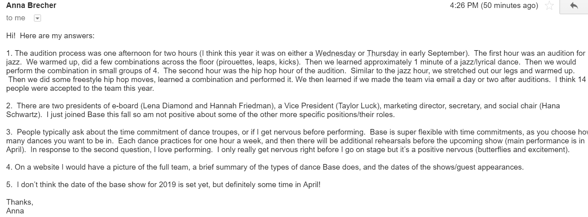
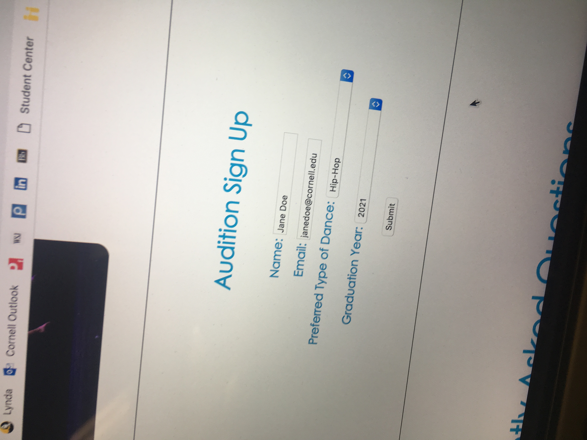

# Project 4 - Design & Plan

Your Team Name: Green Fox

## Milestone 1: Design your Client's Site

### Client Selection (Milestone 1)

#### Client Description

[Tell us about your client. Who is your client? What kind of website do they want? What are their key goals?]

[NOTE: If you are redesigning an existing website, give us the current URL and some screenshots of the current site. Tell us how you plan to update the site in a significant way that meets the Project 4 requirements.]

Our client is Cornell's very own dance team: BASE Productions. This is Cornell's oldest co-ed dance group,  who perform a variety of music styles such as Jazz, Popping, and Breakdancing.

Our client wishes for a website in which they can market and advertise their name on campus. Despite being the oldest co-ed group, some group members had not heard of them. Their key goals are to develop a website where they can:
  - showcase their performances
  - organize ticket sales through online performances
  - develop a more organized process for audition sign-ups
  - have a location where people interested can find all the information needed about the club and what they do


### Client Needs & Wants/Requirements (Milestone 1)

#### Purpose & Content

The purpose of this website is to provide Base Productions, a Cornell dance troupe, with a thorough website to support the team. This will mostly involve auditions and promoting their big showcase every spring, Base in Yo Face. We will help them sell tickets, promote auditions, and showcase the members/photos of dances. People will also be able to sign up for their list serve and receive updates as well as access their social media.

#### Client Needs and Wants

[Collect your client's needs and wants for the website. Come up with several appropriate design ideas on how those needs may be met. In the **Memo** field, justify your ideas and add any additional comments you have. There is no specific number of needs required for this, but you need enough to do the job.]

Example:
- Needs/Wants #1
  - **Needs and Wants** [What does your client and audience need and want?]
    - Client wants people to be able to purchase tickets on their web site.
  - **Design Ideas and Choices** [How will you meet those needs and wants?]
    - We will create a form where users are able to purchase tickets. This will be a separate web page and the nav bar will direct people towards the page where they can buy tickets.
  - **Memo** [Justify your decisions; additional notes.]
    - This is one of the most important functions for the site as the ticket sales for their performance cover their expenses for the entire year. They want to show off their dancing abilities and as a result want to make it easy for people to commit to attending a performance. As a result it should have its own web page dedicated to it enticing users to sign up and buy tickets.
- Needs/Wants #2
  - **Needs and Wants** [What does your client and audience need and want?]
    - Client wants people to be able to sign up for auditions on the web site and have information about their audition process.
  - **Design Ideas and Choices** [How will you meet those needs and wants?]
    - We will create a form where users are able to sign up for available slots to audition. This will be its own separate page and have information about the dates and locations of the auditions.
  - **Memo** [Justify your decisions; additional notes.]
    - This is a page that is very specific to one of our target audiences and not as relevant for performance attendees and the student's parents. Therefore it should have a separate page in the web site so that the information most relevant to that target audience is in one place.
    - In addition to the form there will be information about the audition process so that the potential members can be more informed and feel more comfortable about signing up.
- Needs/Wants #3
  - **Needs and Wants** [What does your client and audience need and want?]
    - Client wants people to be able to show off the executive board members of the club.
  - **Design Ideas and Choices** [How will you meet those needs and wants?]
    - We will create a page highlighting the e-board members and providing a brief bio.
  - **Memo** [Justify your decisions; additional notes.]
    - This will allow people to know their executive board and with a separate page the bios will not distract and clutter the content on the other pages.

#### Client Meeting Notes





### Target Audience (Milestone 1)

#### Target Audience(s)
[Tell us about the specific audience(s) for this website.]

Our target audiences are Cornell students and parents. One target audience is the friends and parents of the performers in BASE that want to attend their performances and keep tabs on the team. They are interested in receiving updates and seeing their friends/children perform. The other target audience is prospective members of BASE who want to learn more about the organization and are interested in auditioning.

#### Target Audience Needs

[What are the needs of your target audience(s)? Note that these are probably *not* the needs of your client.]

Prospective Members:
- What Base is and their focus/mission ("homepage")
- The environment and atmosphere of the team ("eboard" section and links to social media)
- The audition process since those who are planning to audition would be prepared ("audition" section)

Parents/friends of performers:
- What is Base is and their focus/mission ("home page")
- Buying tickets to Base's performances ("tickets" section)
- Members of the Base ("eboard" section)
- Contact form to join list serve so that they can receive email updates regarding performances

### Initial Design (Milestone 1)

#### Content

[Place your content in the **content** folder. NOT in the documents folder.]

[Note any content (e.g., text, image) that you need to make/get from the client here.]
- We have requested pictures of their performances
- We have requested information about their e-board structure, performance dates, and audition process to add into our websites
- We have looked through Facebook, Instagram, and Youtube pages to extract more information to put on the index page and audition page

#### Content Organization, Information Architecture, and Navigation

[Lay out the plan for how you'll organize the site and which content will go where. Plan out the navigation for the site. Document your process for organizing the content.]

[Note: As with the Needs and Wants table, there is no specific amount to write here. You simply need enough content to do the job.]

Example:
- **Navigation**
  - Home
  - Tickets
  - Auditions
  - Eboard

- **Content** (List all the content corresponding to main navigation and sub-categories.)
  - *Home*: includes an introductory paragraph and blurb to describe what BASE is and what they have accomplished. Add pictures and meeting times for general information and have a photo gallery to showcase their performances. It will also have a contact form for people to get in touch with BASE and join their list serve.
  - *Tickets*: form where users can buy tickets to the performance Base in yo'face; description of their annual performance that the users will be buying tickets for as well as the date, time, and location of the performance
  - *Auditions*: form where users can sign up for the audition to join Base; description including the audition process such as dates and locations; FAQ regarding the audition and being a member of BASE
  - *Members*: insert photo of each e-board member alongside a brief bio; Bio will introduce how they got involved in Base and what they have gotten from being part of the team

- **Process**
  - 
  - We thought about ordering the nav bar in the order of most important for the target audience. We felt Cornell students would want to see more of what the group does so the index page (homepage) is first. Then ticket sales and auditions are most important for the group as they market their performances and recruit new members. Lastly, the e-board members is supplementary information if users wish to know more so we placed it at the end.
  - Home Page: We decided this page would include introductory information about the club, their meeting times, and just more pictures along with the interactive gallery to spark initial interest when they come to the page. If after seeing the gallery the user is interested, they will be able to fill out the contact form to join the list serve.
  - Ticket Page: On this page we will have an image and description about their annual concerts and have a form to buy tickets for those interested in watching the showcase.
  - Audition Page: This page has the audition process and other logistics regarding recruiting. This is an important page for our target audience and so we also have a form to fill out for audition sign-ups. It will also have an FAQ section to give prospective students more information and make them less nervous about the audition process.
  - E-board Page: This page consists of the e-board members and it will be structured with a picture and a brief blurb about who they are and what they do. This is more for students to get a sense of the club's atmosphere and become more familiar with the members.

#### Sketches

[Include exploratory idea sketches of your website.]
- E-board:


- Ticket form:


- Audition form:


- Homepage (index):


[Include sketches of your finalized design.]

Desktop


Mobile


#### Interactivity

We will have 4 interactivity components: a slideshow and three forms (one contact form, one for ticket sales, and one for audition sign ups). The slideshow is the best way to easily display a large number of photos. It will appear on the home screen to give users a glimpse of the dance troupe. Ticket sales will be included to help increase sales for their spring showcase and allow supporters to easily buy online rather than tracking down a team member. Finally, we will have audition sign ups so that they can plan in advance for how many people may show up. The contact form provides a convenient place for people to sign up and receive updates and makes it easy for the members to keep track of those who want updates.

These interactivity components are relevant to our client because it helps ease the process for both auditions, tickets, and the list serve by including these useful forms. Additionally, they can better showcase talent, help increase ticket sales, and draw in potential new dancers by including the slideshow. For Cornell students, this brings an automated way to see what performances happen at their annual showcase. Pictures are always eye-catching and draw the attention of the audience.

#### Additional Comments (Milestone 1)

[If you feel like you haven't fully explained your design choices, or if you want to explain some other functions in your site (such as special design decisions that might not meet the Project 4 requirements), you can use this space to justify your design choices or ask other questions about the project and process.]

We added an FAQ section to make it easier for prospective members to get information about the audition process and joining the team. It also makes it easier for the client as they do not have to answer as many inquiries regarding the same questions.


## Milestone 2: Draft of Coded Website

### Interactivity (Milestone 2)

[Write your interactivity pseudocode here. Remember you must use two conditional statements.]

Example:
```
if today is a monday:
  show Monday's soup and the daily special

```
Slideshow:
- When user clicks the next button:
- If the user reaches the last image:
  - return to first image
- otherwise:
  - move to next image in the array

(in order to simplify code, the % function was implemented in the function)

Auditions Form:
When the user tries to submit the form:
If Name is empty:
  Show a feedback message to "Please enter your full name"
  Do not submit the form.
If the email is empty:
  Show a feedback message to "Please enter a valid email"
  Do not submit the form.
If type of preferred dance is not selected:
  Show a feedback message to "Please select your preferred dance style."
  Do not submit the form.
If the graduation year is not selected:
  Show a feedback message to "Please select your expected graduation year"
  Do not submit the form.
  Otherwise,
    Show no feedback message.
    Submit the form.

Ticket Form
- If "name" field has no input or is not valid:
  - do not submit the form and provide feedback "Please enter your name"
- If "email" has not input or is not a valid email:
  - do not submit the form and provide feedback "Please enter a valid email"
- If "number of tickets" is less than 1 or not a number:
  - do not submit the form and provide feedback "Please choose at least one ticket"
- otherwise:
  - submit the form

### Tasks (Milestone 2)

[You will need to come up with at least 4 tasks. List your tasks here. You *do not* have to do user tests yet.]


##Index
Task 1: Tell me the times and locations of the weekly practices.

##Ticket
Task 2: Buy 3 tickets using the name John Smith, the email smith@cornell.edu, and pick them up at the door.

##Audition
Task 3: Sign up to audition for hip-hop using the name Jane Doe and email janedoe@cornell.edu and graduating in 2021.

##E-board
Task 4: Find the information on who the current president is and how they first found out about BASE.

### Client Meeting (Milestone 2)


### Additional Comments (Milestone 2)

[If you feel like you haven't fully explained your design choices, or if you want to explain some other functions in your site (such as special design decisions that might not meet the Project 4 requirements), you can use this space to justify your design choices or ask other questions about the project and process.]

We have switched around our formatting on the content on the eboard and index page to better meet our client's need of clean formatting for better visual aid for audience.

In addition, we have changed the navigation bar in order to have a more modern and unique feel rather than the traditional nav bar on top.

We also decided to make the photo gallery separate on the bottom of the page as it would be too messy with the nav bar in the header to have moving images in the header.

We also decided to add a nav bar on the bottom for better transition from page to page so the user does not have to move up to the top to move to a different link.


## Milestone 3: Presentation & Demo Ready Draft

### Additional Comments (Milestone 3)

[If you feel like you haven't fully explained your design choices, or if you want to explain some other functions in your site (such as special design decisions that might not meet the Project 4 requirements), you can use this space to justify your design choices or ask other questions about the project and process.]

Despite the professor stating that hero images were bad design choices, we made it significant part of our design in the initial design and the sketches. We also integrated our nav bar into the header that contains the hero image so we believe it is detrimental to remove it at this point. There was no specific criteria on hero images in the rubrics so far so we believe there should be no penalty for having this. We showed our design to the professor during lab and he raved about our home screen, saying it was stunning visually and was a great example of using contrast.


## Final Submission: Complete, Polished, and User Tested Website

### Changes Based on Presentation (Final Submission)

[What changes did you make to your plan or design based on your peers' feedback?]

- Recommendation 1: some text and headings weren't visible.
- Resolution: we may believe it was because the screen in lab was so large and we only planned for mobile and desktop. However, we still changed some of the font sizes to make them more visible for audience members.

- Recommendation 2: text within the paragraphs that were a different color didn't go with color scheme
- Resolution: changed the spans to have the blue color within the logo to make it more consistent.

- Recommendation 3: navigation bar isn't totally responsive with the iPhone X and iPhone 5
- Resolution: changed the margins of the nav links so when the width of the page shrinks the nav bar isn't outside the margins of the page. It now is responsive.

### User Testing (Final Submission)

#### Participant 1

1. Who is your participant, e.g., what is their name, where do they comes from, what is their job, characteristics, etc.?

Name: Sharon Park

From: Long Island, NY

Job: Freshman Animal Science Major @ Cornell University

Characteristics: College student, just entered college so does not really know many clubs and is still looking for new things to join, interactive in searching for new clubs, loves to listen to music and dance.

2. Does your participant belong to your target audience of the site? (Yes)

[If “No”, what’s your strategy of associating the user test results to your target audience’s needs and wants? How can your re-design choices based on the user tests make a better fit for the target audience?]

She is in the part of the audience that wants to learn more about different dance groups on campus and would potentially audition.

[Report the results for your user's performance on each of your tasks. You should **describe the task** you ask the user to complete, explain **what the user did**, describe the user's **reaction/feedback** to the design, **reflect on the user's performance**, determine what **re-design choices** you will make. You can also add any additional comments in the **memo** field.]

Format:

- Task #1
  - **Task Description** (What was the task for this user?)
    - Task 1: Tell me the times and locations of the weekly practices.
  - **How did the user do? Did that meet your expectation?**
    - user met expectations
    - she was able to tell the locations and the times for each practice
  - **User’s reaction / feedback to the design** (e.g., specific problems or issues found in the tasks)
    - She suggested that some freshman don't know where the locations of these practices are
    - She said adding a map might be helpful
    - Questioned why the second row was gray (explained it was for contrast)
  - **Your reflections about the user’s performance to the task**
    - Very helpful insight that will help enhance our website from a freshman perspective
  - **Re-design choices**
    - Add images of the maps of the locations on practices onto the website
  - **Memo** (Justify your decisions; additional notes.)
    - None

- Task #2
  - **Task Description** (What was the task for this user?)
    - Task 2: Buy 3 tickets using the name John Smith, the email smith@cornell.edu, and pick them up at the door.
  - **How did the user do? Did that meet your expectation?**
    - She was able to complete the task very easily
  - **User’s reaction / feedback to the design** (e.g., specific problems or issues found in the tasks)
    - Liked the design and color scheme
    - Also liked the simpleness and easy to use feature
    - Noted font size may be a little too small
    - Said there was no information about the event itself and the ticket prices
  - **Your reflections about the user’s performance to the task**
    - Helpful information we didn't really consider and need to add to make it better
  - **Re-design choices**
    - Font size increase
    - Added information about the website
  - **Memo** (Justify your decisions; additional notes.)
    - Found this user testing to be significantly more helpful

- Task #3
  - **Task Description** (What was the task for this user?)
    - Task 3: Sign up to audition for hip-hop using the name Jane Doe with email janedoe@cornell.edu and graduating in 2021.
  - **How did the user do? Did that meet your expectation?**
    - Great performance and was able to successfully submit the ticket
  - **User’s reaction / feedback to the design** (e.g., specific problems or issues found in the tasks)
    - Loves the consistency of both forms (audition and ticket)
    - Wishes to know more information about the auditions and other details
  - **Your reflections about the user’s performance to the task**
    - Gave great feedback regarding our forms
    - Important that we provide enough information for the users
  - **Re-design choices**
    - Decided to add information about the auditions itself
  - **Memo** (Justify your decisions; additional notes.)
    - Adding information about the auditions themselves is more helpful to the user and makes it more likely that they will fill out the form.

- Task #4
  - **Task Description** (What was the task for this user?)
    - Task 4: Find the information on who the current president is and how they first found out about BASE.
  - **How did the user do? Did that meet your expectation?**
    - Was able to go under the correct tab and find the President
  - **User’s reaction / feedback to the design** (e.g., specific problems or issues found in the tasks)
    - Loves the design of the e-board page and how each person has the same format
  - **Your reflections about the user’s performance to the task**
    - Was a great user and definitely gave helpful feedback
  - **Re-design choices**
    - None
  - **Memo** (Justify your decisions; additional notes.)
    - Overall, got a lot of feedback that helped in making our website better.


[Include evidence of your user testing process.]





#### Participant 2

1. Who is your participant, e.g., what is their name, where do they comes from, what is their job, characteristics, etc.?

Name: Daniel Lee

From: Seoul, Korea

Job: Information science major, Cornell University

Characteristics: He is a freshman, class of 2022. Currently involved in another on-campus dance organization called E-motion. Interested in dancing and likes to study at Carpenter.

2. Does your participant belong to your target audience of the site? (Yes)

Yes, he is an underclassmen. He also has intentions to attend the showcase and maybe audition next year. He heard about BASE from his friends.

[If “No”, what’s your strategy of associating the user test results to your target audience’s needs and wants? How can your re-design choices based on the user tests make a better fit for the target audience?]

[Fill this out like you did for Participant 1 above]
Format:

- Task #1
  - **Task Description** (What was the task for this user?)
    - Tell me the times and locations of the weekly practices.
  - **How did the user do? Did that meet your expectation?**
    - Met expectations
    - He was able to find the information in less than 1 minute
  - **User’s reaction / feedback to the design** (e.g., specific problems or issues found in the tasks)
    - The layout was very neat and easy to read which made the information quick to find
    - Alternating row colors makes the content easy to read
    - Likes the color scheme
    - Nav bar font can be bigger, maybe bolded (user was on half-screen, mobile response mode)
  - **Your reflections about the user’s performance to the task**
    - Satisfied with his performance and comments
  - **Re-design choices**
    - increase the nav bar font when on mobile response
  - **Memo** (Justify your decisions; additional notes.)
    - Making the nav bar bigger in mobile phone will make it easier for the user to read on a mobile screen

- Task #2
  - **Task Description** (What was the task for this user?)
    - Buy 3 tickets using the name John Smith, the email smith@cornell.edu, and pick them up at the door.
  - **How did the user do? Did that meet your expectation?**
    - Met expectations
    - Finished relatively fast
  - **User’s reaction / feedback to the design** (e.g., specific problems or issues found in the tasks)
    - The form looked unfinished and off
    - He was filling out the form using half-screen (mobile response)
    - functioned properly
  - **Your reflections about the user’s performance to the task**
    - The mobile response of the form needs to be revised
  - **Re-design choices**
    - Modify css for the forms
    - The labels should be left aligned
    - Have all the labels go above the inputs and make the input width 100%.
  - **Memo** (Justify your decisions; additional notes.)
    - Having the labels left-aligned is more conventional since people read from left from right
    - With all the labels above the inputs, it will fit the mobile response dimensions and look clean

- Task #3
  - **Task Description** (What was the task for this user?)
    - Sign up to audition for hip-hop using the name Jane Doe with email janedoe@cornell.edu and graduating in 2021.
  - **How did the user do? Did that meet your expectation?**
    - Paused shortly at the "preferred type of dance" and confirmed the task again for information
  - **User’s reaction / feedback to the design** (e.g., specific problems or issues found in the tasks)
    - Form format is weird, same as the ticket form
  - **Your reflections about the user’s performance to the task**
    - It was nice to have the user mention the styling issue
    - might not have been aware if user didn't point it out
  - **Re-design choices**
    - Same as Task 2
  - **Memo** (Justify your decisions; additional notes.)
    - Our changing of the forms to make them left-aligned makes them easier to read and fill out
    - Having the label above the input box makes it easier to fill out as the input box is not too small in the mobile screen and the label is more readable.

- Task #4
  - **Task Description** (What was the task for this user?)
    - Find the information on who the current president is and how they first found out about BASE.
  - **How did the user do? Did that meet your expectation?**
    - Met expectations
    - Was able to find the correct information in less than 1 min
  - **User’s reaction / feedback to the design** (e.g., specific problems or issues found in the tasks)
    - Likes how the president shared her experience as a Freshman
    - Likes the additional nav bar in the footer, don't need to scroll back up to re-navigate
  - **Your reflections about the user’s performance to the task**
    - User performed really well
  - **Re-design choices**
    - N/a
  - **Memo** (Justify your decisions; additional notes.)
    - N/a

[Include evidence of your user testing process.]


#### Participant 3

1. Who is your participant, e.g., what is their name, where do they comes from, what is their job, characteristics, etc.?

Name: Rachel Straub

From: Los Angeles, California

Job: Biology Major, Cornell University

Characteristics: Senior, best friend has been in BASE since freshman year, attends annual showcase every year, wants an easier way to buy tickets and keep track of the team.


2. Does your participant belong to your target audience of the site? (Yes / No)

Yes - she is in the category of friends and family who are interested in supporting BASE and attending their performances

[If “No”, what’s your strategy of associating the user test results to your target audience’s needs and wants? How can your re-design choices based on the user tests make a better fit for the target audience?]

[Fill this out like you did for Participant 1 above]

- Task #1
  - **Task Description** (What was the task for this user?)
    - Tell me the times and locations of the weekly practices.
  - **How did the user do? Did that meet your expectation?**
    - Scrolled down and found the information easily
    - Met expectations
  - **User’s reaction / feedback to the design** (e.g., specific problems or issues found in the tasks)
    - Did not immediately know there was weekly practices and the message was not eye catching
    - Thought "Pump up the Base" was a link based on the color
  - **Your reflections about the user’s performance to the task**
    - Need to draw more attention so that it is more clear the chart is for weekly practices
  - **Re-design choices**
    - Change the styling of the word "weekly practice" so it is a different color and is more noticeable
    - Change the color of the special font to be the same blue as the logo
  - **Memo** (Justify your decisions; additional notes.)
    - By changing the color, even if people are just scanning over the paragraph without reading it, the user is able to see the important information.
    - Changing the color brings more consistency on each page and makes it clear to the user that it is not a link to click.

- Task #2
  - **Task Description** (What was the task for this user?)
    - Buy 3 tickets using the name John Smith, the email smith@cornell.edu, and pick them up at the door.
  - **How did the user do? Did that meet your expectation?**
    - User filled out the information with no problems.
  - **User’s reaction / feedback to the design** (e.g., specific problems or issues found in the tasks)
    - The user thought having the information for the top blurbs to the left looked strange and breaks up the flow of reading the information.
  - **Your reflections about the user’s performance to the task**
    - Happy with their performance.
    - Need to format the ticket information so that it looks like it fits with the form.
  - **Re-design choices**
    - Centering the content that gives information about buying the tickets.
  - **Memo** (Justify your decisions; additional notes.)
    - Centering the content makes it easier to read the information and then fill out the form as everything appears to be grouped together rather then two separate pieces of content.

- Task #3
  - **Task Description** (What was the task for this user?)
    - Sign up to audition for hip-hop using the name Jane Doe with email janedoe@cornell.edu and graduating in 2021.
  - **How did the user do? Did that meet your expectation?**
    - Filled out the form easily.
  - **User’s reaction / feedback to the design** (e.g., specific problems or issues found in the tasks)
    - Liked the form and the FAQ section.
    - User worried that people would fill out the form and stop as there is a lot of whitespace between the two sections.
  - **Your reflections about the user’s performance to the task**
    - Happy they were able to fill out the form with no problems.
    - They raise an important question regarding usability of the site and our current design involving too much scrolling.
  - **Re-design choices**
    - Lessen the whitespace in between the audition form and FAQ section.
  - **Memo** (Justify your decisions; additional notes.)
    - By lessening the whitespace we make it so that the user has to scroll less in order to see all the content. It also makes it less likely that the user will go to another page or website and miss the FAQ section entirely.

- Task #4
  - **Task Description** (What was the task for this user?)
    - Find the information on who the current president is and how they first found out about BASE.
  - **How did the user do? Did that meet your expectation?**
    - Went to the eboard page and found the information easily, but thought both were presidents at first.
  - **User’s reaction / feedback to the design** (e.g., specific problems or issues found in the tasks)
    - Thought it would make it easier if the person's role was highlighted.
  - **Your reflections about the user’s performance to the task**
    - Pleased they found the information, but realize it could be easier to quickly scan the page and see the most important content.
  - **Re-design choices**
    - Change the formatting of their title to make it more eye-catching.
  - **Memo** (Justify your decisions; additional notes.)
    - Changing the formatting makes it easier for users to find the information they care most about without reading the paragraph. It draws the eye to the most important piece of information on the page.

[Include evidence of your user testing process.]


### Changes Based on User Testing (Final Submission)

[What changes did you make to your plan or design based on user testing?]

From user testing we made several important changes regarding formatting and content to make the website more user-friendly. On the content side, we added information to encourage and help the user fill out the forms. For the ticket form, we added information about the date, time, and location of the performance as well as the price of a ticket. For the auditions, we added information regarding the date and times of both the hip-hop and jazz audition. Both of these forms are significantly improved by this information added to the page and were valuable insights gained from user testing. We also included a map so that prospective students (who are mainly freshman) would know the locations of the auditions.

For formatting, we were able to improve our design to help the users navigate the content. We changed the color of some of the text in the paragraphs to ensure that they were not misconstrued for links and that it would be easier for the user to scan the paragraphs for the important information if they did not want to read it in depth. We also changed the format of the forms for mobile responsive so that it was easier to read and fill out. The content detailing the performance for the ticket form was more centered so that it was more clearly matched with the form.

Other formatting changes included increasing the nav bar font in the responsive design so that it is easier to read on a mobile screen. We also lessened the whitespace in between our content in each page, particularly on the audition page between the form and the FAQ page. We received positive feedback for our content and the user wanted to make sure people saw if and did not have to scroll more and/or stop because they thought they reached the end of the page.

### Final Notes to the Clients (Final Submission)

[Describe in some detail what the client will do (or would have to do) in order to make this website go live. What is the deployment plan?]

[Include any other information that your client needs to know about your final website design. For example, what client wants or needs were unable to be realized in your final product? Why were you unable to meet those wants/needs?]

We were able to complete all of the client's requests and included some additional features that they appreciated. The website is already deployed on heroku (https://afternoon-inlet-52371.herokuapp.com/www/index.html) and with a credit card we can set up secure form emailing so that they can receive answers to the form submissions. This is free for the first 12,000 requests, however it requires a credit card to set up. We already have an email set up to receive those emails (baseproductions2019@gmail.com) and just need their information to set up that feature. If they do not want to use a credit card, we can utilize provided .php files to send it to an email of their choice.

### Final Notes to the Graders (Final Submission)

[1. Give us three specific strengths of your site that sets it apart from the previous website of the client (if applicable) and/or from other websites. Think of this as your chance to argue for the things you did really well.]

- Forms adding needed functionality: The contact form is a functionality that BASE does not currently have anywhere else. By allowing people to reach out and sign up for their list serve, they make it easy to keep track of who wants updates on base. It also allows parents and students who did not sign up on Club Fest to join the list serve, which would have required contacting a current member beforehand. Similarly, the audition form and ticket form provide great value to our target audiences that they previously did not have anywhere online. The forms streamline several of BASE's processes and makes planning for auditions and performances easier for both BASE and their supporters.

- Slideshow: We automated our slide show to constantly show eye-catching photos of BASE. The main purpose of this website is for students to come and actually click around to know and get interested in BASE. Therefore, by constantly showing new content, we believe this will aid in catching people's eyes and interests.

- Header/ nav bar: We believe that we really made the most use of our header/ hero image. We maximized contrast so that it would be very easy on the eyes and the nav bar would be differentiated significantly. We capitalized on our use of an unconventional nav bar to show a more trendy and new look. We believe since it is the first thing our audience sees when they open the website, it needed to be really eye-catching and giving a response of "wow". We believe we have done this and it sets it apart from other dance group websites on campus. In addition to the navigation in the site itself, we make it easy for users to explore BASE further by providing clear links in the header and footer that go to BASE's respective social media pages. BASE loves this feature because it draws more people to their social media presence. The target audience of parents/friends appreciate this functionality because they can show their support for the team online and see more pictures of their practices, performances, and social events. Their social media also provides more information to prospective dancers about what it is like being on the team both in terms of the dancing and social component.

[2. Tell us about things that don't work, what you wanted to implement, or what you would do if you keep working with the client in the future. Give justifications.]

Ideally we would implement a payment functionality so that customers can pay with their credit card online rather than with cash at the door. Implementing this is beyond the scope of the class and would involve working with payment processors such as Paypal and Stripe. If we keep working with the client in the future we will set up those accounts and link them to the website, as well as add SSL to ensure the website is secure enough. This will make it much easier for parents and students to purchase tickets on the site.

[3. Tell us anything else you need us to know for when we're looking at the project.]

We really tried to make it have a hip-hop/ trendy field matching the attitude and theme of BASE. We used popping colors and an unconventional nav bar. We also linked all forms of social media onto the website for maximum marketing and branding. After meeting with our client for the last time, they absolutely loved the new website.
